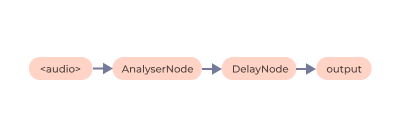
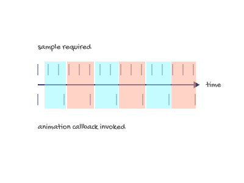

# Music Visualizer (v2)
For visualizing sound intensity over time.
Visualize Music/Audio Spectrum

## Usage:

- Change `src` property of `<source src="music.mp3">` in the [index.html](src/index.html) with the audio file you want to Visualize.
- Change the song BPM by chaning the value of `songTempoBpm` Variable in [index.js](src/index.js)
- Simply open index.html

## Terminologies:

### Bar:

Each one of these things is a bar which represents how high or low the Audio Spectrum is at that Particular point

### Sample:

The amplitude (or volume) of the audio signal over a short duration of time.
This is represented as the height of the bar at a given time.

The sample producer analyses the audio and produces periodic samples based on
the song tempo/BPM (beats per minute) and the number of bars in the UI.

Samples move from right towards left in the UI, with the newly produced sample
pushing out the oldest sample from the left.

## Working:

If the song tempo is 120 BPM, each beat occurs at 500ms (60 * 1000 / 120). If
we have 10 bars, we expect samples to be produced at an interval of 50ms
(500 / 10) so that a given sample would have traveled through all the bars
between consecutive beats of the song.

#### Connections:

### Audio info

The Web Audio API provides AnalyserNode which can be used to obtain the audio
amplitude over a frame of time... Read More About Web Audio API at [MDN Docs](https://developer.mozilla.org/en-US/docs/Web/API/Web_Audio_API)

### Animation

`window.requestAnimationFrame` is used for invoking a callback for every screen
refresh (which would mostly be 60 times a second). The callback has access to a
high resolution timestamp which is used to track which the previous sample was
produced and when the next one should be produced.

### Producing samples

From the song temp, the expected sample interval is determined. When the animate
callback is invoked, the time between the last produced sample and current
timestamp is calculated to find the number of samples that should have been
produced in that interval, and use the average of the audio volume in this time
frame as the sample value and produce it.

If more than one samples are required, we just use the same value for all.

### Delay

A delay is introduced in the audio matching the value of a single beat so that
the beat hits when the wave reaches the left end.

### Cases

1. When the tempo of the song is high and frame rate is low

For eg: if the song tempo is 240 BPM (4 per second) and we have 10 bars, we
would need to produce 40 samples per second. But if the screen refresh rate is
only 20 fps, we would need to produce 2 samples each time the callback is
invoked.

Very rare, unless you are listening to Drum and Bass in a laptop from the 90s.

2. When the tempo of the song is low and frame rate is high

For eg: the more common use case, say 60fps, but the song is 120 BPM (or 2 per
second), and same 10 bars (so need to produce 20 bars per second), we can
comfortably produce samples at one or less than one each callback.

;

## How amplitude is calculated:

The AnalyserNode gives an array of audio decibels for individual audio frames.
Individual values are first converted to absolute (changing negative to
positive) and then averaged to get an indication of the overall audio volume
in that time slot.
